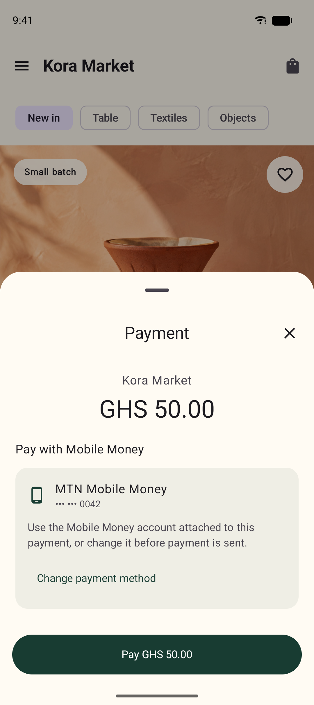
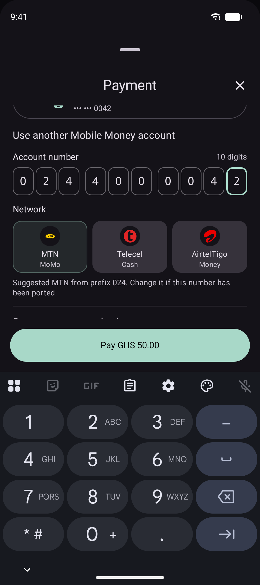
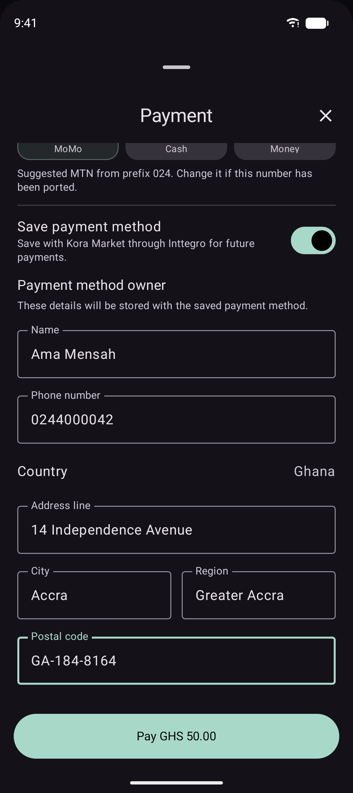
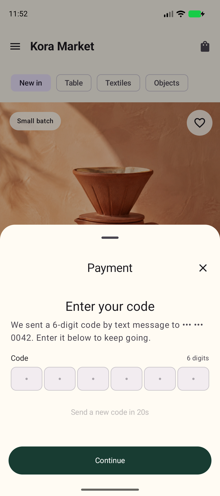
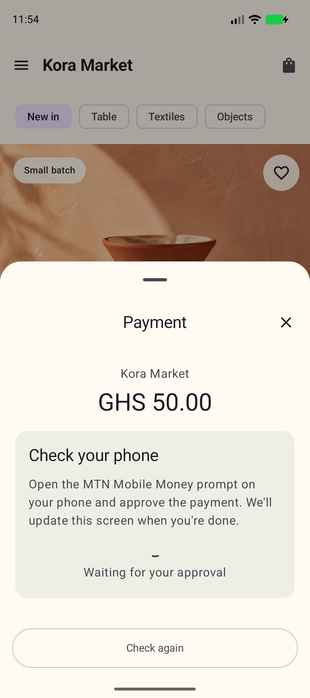
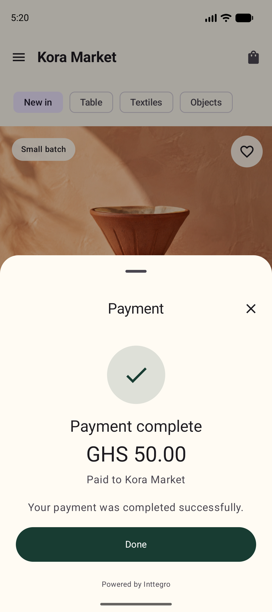

# Inttegro Jetpack Compose demo

**Kora Market** is a Material 3 product experience with category chips, product
imagery, finish selection, fulfillment context, and a persistent checkout bar.
It consumes the local Inttegro SDK module and presents
`InttegroPaymentSheet` without embedding a merchant API key.

The app asks the Kora Market backend for a finalized mobile-money-only order,
then uses the SDK's native Checkout transport. Payment-sheet telemetry is sent
to Logcat under `InttegroPaymentSheet` without installing an exporter.

## Native payment sheet

<table>
  <tr>
    <td></td>
    <td></td>
  </tr>
  <tr>
    <td></td>
    <td></td>
  </tr>
  <tr>
    <td></td>
    <td></td>
  </tr>
</table>

These are genuine captures of the production Compose sheet running on a Pixel
9 Android emulator. The local capture adapter supplies deterministic checkout
data and never sends a payment.

## Run

Set `INTTEGRO_DEMO_BACKEND_URL` or the `inttegroDemoBackendUrl` Gradle property,
open this directory in Android Studio, let Gradle sync, choose an emulator, and
run the `app` configuration. Android Emulator reaches a local Next.js server at
`http://10.0.2.2:3000`.

## Check

The repository includes a Gradle wrapper:

```sh
./gradlew :app:assembleDebug
```

## Capture documentation screenshots

Build with deterministic, non-sensitive checkout data when capturing the real
Android SDK UI for documentation:

```sh
./gradlew :app:assembleDebug -PinttegroScreenshotMode=true
```

This mode opens the production `InttegroPaymentSheet` automatically and injects
only a local adapter. It does not call the Checkout API or require merchant
credentials. Builds without the property keep the normal backend flow.

Choose **Pay** to reach the one-time-code screen, enter any six digits and
choose **Continue** to reach the approval screen, then choose **Check again** to
reach the completed state.

Add `-PinttegroScreenshotFeatures=true` to capture the optional-feature story.
The opening sheet offers a collapsed Order summary and keeps the attached
payment method fixed. Opening the summary expands the sheet as the
Checkout-provided line items are revealed. Its completed state offers both
invoice and receipt downloads. These actions use inert documentation URLs and
should not be opened during capture.

A production app receives only a finalized `orderId` created by its backend.
Fulfillment still relies on authoritative server-side payment status.

## Deploy the companion backend

[](https://deploy.workers.cloudflare.com/?url=https://github.com/zebodotdev/inttegro-demos/tree/deploy-nextjs-v1.8.2)
[](../nextjs/README.md#run-with-docker)
[](https://vercel.com/new/clone?repository-url=https%3A%2F%2Fgithub.com%2Fzebodotdev%2Finttegro-demos%2Ftree%2Fdeploy-nextjs-v1.8.2&project-name=inttegro-demo-nextjs&repository-name=inttegro-demo-nextjs&env=INTTEGRO_API_KEY%2CINTTEGRO_DEMO_PRODUCT_ID%2CINTTEGRO_DEMO_PRICE_ID%2CINTTEGRO_DEMO_CUSTOMER_ID%2CINTTEGRO_DEMO_PUBLIC_URL&envDescription=Add%20a%20dedicated%20Inttegro%20API%20key%2C%20active%20Product%20and%20Price%20IDs%2C%20demo%20Customer%20ID%2C%20and%20the%20public%20origin.&envLink=https%3A%2F%2Fstudio.inttegro.com%2Fkeys)

These buttons create the Next.js companion service in your own account. Put its
public origin in `INTTEGRO_DEMO_BACKEND_URL`; the native app never receives the
server-held Inttegro API key. The buttons use release `v1.8.2`.

## Understand the integration

Start with
[`DemoBackend.kt`](./app/src/main/java/com/inttegro/demo/compose/DemoBackend.kt)
for the merchant-backend trust boundary, then read
[`MainActivity.kt`](./app/src/main/java/com/inttegro/demo/compose/MainActivity.kt)
for sheet presentation, telemetry, and result semantics. The `INTTEGRO:*`
comments map choices and alternatives to the shared
[integration guide](../INTEGRATION_GUIDE.md) and
[machine-readable decision registry](../integration-decisions.json).
